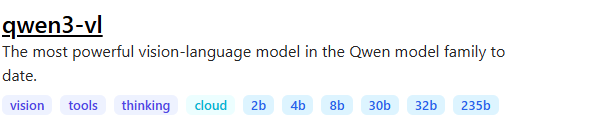
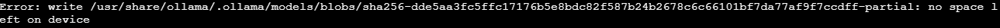
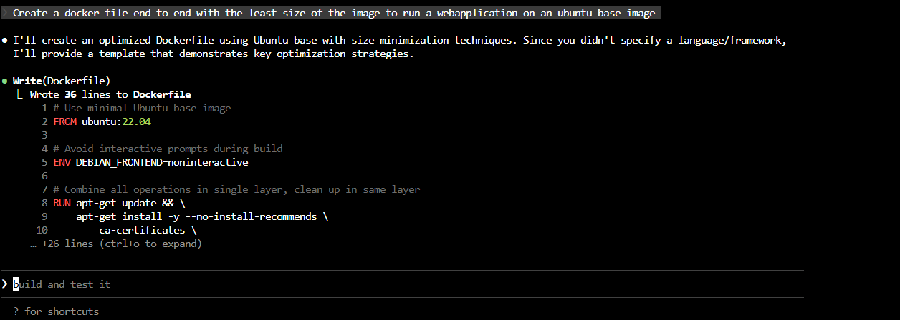
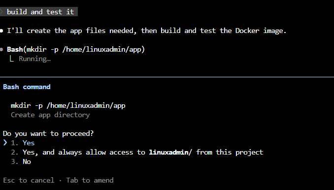
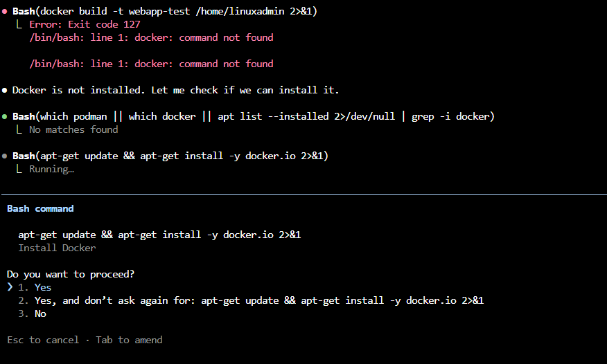

# LLMs-with-Ollama

```bash
sudo apt update && sudo apt install zstd   
```

zstd is required to extract Ollama's .tar.zst distribution files on Linux and other systems.  The ollama installation script checks for zstd and will prompt you to install it

```bash
root@ubuntu-host ~ ➜  curl -fsSL https://ollama.com/install.sh | sh
>>> Cleaning up old version at /usr/local/lib/ollama
>>> Installing ollama to /usr/local
>>> Downloading ollama-linux-amd64.tar.zst
######################################################################## 100.0%
>>> Creating ollama user...
>>> Adding ollama user to video group...
>>> Adding current user to ollama group...
>>> Creating ollama systemd service...
>>> Enabling and starting ollama service...
Created symlink /etc/systemd/system/default.target.wants/ollama.service → /etc/systemd/system/ollama.service.
WARNING: Unable to detect NVIDIA/AMD GPU. Install lspci or lshw to automatically detect and install GPU dependencies.
```

Ollama Registry Connection

**Ollama is by default connected to the public model registry** (`registry.ollama.ai`) without requiring authentication for basic operations like pulling and running publicly available models.

- **Connection**: When you run `ollama run <model>` or `ollama pull <model>`, Ollama automatically connects to the default registry at `registry.ollama.ai` to fetch model manifests and blobs.
- **Authentication**: **No authentication is required** to pull or run standard models from the public registry. The registry is designed to be publicly accessible.
- **Model Manifests**: The manifest (a JSON file listing required blobs and metadata) is downloaded from the registry as part of the pull process. It includes the model's configuration, tag, and list of blob hashes.
- **Security Note**: While the public registry is safe for official models, **avoid exposing Ollama’s API publicly** (port 11434) without authentication, as past vulnerabilities (e.g., CVE-2024–37032) could allow remote code execution if the API is exposed externally.

For private or custom registries, configuration is required via environment variables or settings (e.g., `OLLAMA_HOST` or custom `Modelfile` references), but this is not needed for default public model usage.


```bash
root@ubuntu-host ~ ✖ ollama run llama3.2
pulling manifest 
pulling dde5aa3fc5ff: 100% ▕████████████████████████████████████████▏ 2.0 GB                         
pulling 966de95ca8a6: 100% ▕████████████████████████████████████████▏ 1.4 KB                         
pulling fcc5a6bec9da: 100% ▕████████████████████████████████████████▏ 7.7 KB                         
pulling a70ff7e570d9: 100% ▕████████████████████████████████████████▏ 6.0 KB                         
pulling 56bb8bd477a5: 100% ▕████████████████████████████████████████▏   96 B                         
pulling 34bb5ab01051: 100% ▕████████████████████████████████████████▏  561 B                         
verifying sha256 digest 
writing manifest 
success 
>>> /?
Available Commands:
  /set            Set session variables
  /show           Show model information
  /load <model>   Load a session or model
  /save <model>   Save your current session
  /clear          Clear session context
  /bye            Exit
  /?, /help       Help for a command
  /? shortcuts    Help for keyboard shortcuts

Use """ to begin a multi-line message.

>>> Hello, how you doin?
I'm just a language model, so I don't have feelings or emotions like humans do, but thanks for 
asking! How can I assist you today?
>>> /bye

root@ubuntu-host ~ ➜  
```




The **2b, 4b, 8b, 30b, 32b, 235b** tags refer to different **parameter sizes** of the Qwen3-VL model family, where "b" stands for **billion parameters**.  These represent distinct versions of the model with varying levels of capacity, performance, and hardware requirements. 

- **Smaller models (2B, 4B, 8B)**:  
  Optimized for efficiency and local deployment. They run faster and require less VRAM, making them suitable for laptops or edge devices. For example:
  - `qwen3-vl:2b` (~1.9GB) can run on modest hardware.
  - `qwen3-vl:8b` (~6.1GB) offers a balance between performance and resource usage. 

- **Larger models (30B, 32B, 235B)**:  
  Deliver stronger reasoning, vision-language understanding, and multimodal capabilities but require high-end GPUs or cloud infrastructure:
  - `qwen3-vl:30b` (~20GB) and `qwen3-vl:32b` (~21GB) are powerful generalists.
  - `qwen3-vl:235b` (~143GB) is the largest, intended for research or enterprise use. 

These models support **256K context windows**, handle text, images, and video, and include features like visual agent capabilities and advanced OCR. You can choose the variant that best fits your hardware and use case.

Once an Ollama model is downloaded, its **manifest is stored locally** in the `~/.ollama/models/manifests/` directory (on Linux/macOS) or `%USERPROFILE%\.ollama\models\manifests\` on Windows.  The manifest is a JSON file that describes the model’s configuration, parameters, and lists the **blobs** (chunks of model weights) stored in `~/.ollama/models/blobs/`. 

When you send a prompt, your local Ollama instance:
1. Checks if the requested model is already loaded in memory.
2. If not, loads it from the local blob files using the manifest as a blueprint.
3. Communicates via an internal HTTP server (default: `http://localhost:11434`) — either through the CLI or API.
4. Processes the prompt using the model and returns the response. 

The `ollama serve` command runs this server, enabling API access (e.g., `/api/generate` or OpenAI-compatible `/v1/chat/completions`).

Yes, **port 11434 is assigned by default** for Ollama.  It binds to `127.0.0.1:11434` (localhost) automatically when the Ollama service starts. 

You **do not need to explicitly run `ollama serve`** in most cases.  The `ollama run <model_name>` command automatically ensures the server is running. If the server isn't already active, `ollama run` will start it in the background. 

- `ollama serve`: Starts the Ollama server (HTTP API on port 11434). Useful for headless or server setups.
- `ollama run <model>`: Downloads (if needed), loads, and interacts with a model. It implicitly starts the server if not running. 

So, after installing Ollama, simply running `ollama run llama3` will:
1. Start the server on port 11434 (if not already running)
2. Load the model
3. Open an interactive session 

The server continues running in the background for API access.

```bash
bob@node01 ~ ✦ ✖ ollama list
NAME                  ID              SIZE      MODIFIED      
deepseek-r1:latest    6995872bfe4c    5.2 GB    7 minutes ago
```

Other Ollama CLI commands:

```bash
ollama pull <model_name> # Just download the model from the registry
ollama rm <model_name> # Delete the model from the local, if run again - will freshly pull from model registry
ollama show <model_name> # Only displays information about models that have already been pulled and are present locally on your machine.
ollama ps # Shows which models are running in my local machine at the instant
```

Created Ec2 instance for running my ollama server, but faced this error



Hence attached a volume to the ec2 instance. Your EBS volume must be in the same Availability Zone (AZ) as the EC2 instance to which it is attached.

```bash
#30G disk created attached to the instance in the same AZ

ubuntu@ip-172-31-23-129:~$ lsblk
NAME     MAJ:MIN RM  SIZE RO TYPE MOUNTPOINTS
loop0      7:0    0 27.6M  1 loop /snap/amazon-ssm-agent/11797
loop1      7:1    0   74M  1 loop /snap/core22/2163
loop2      7:2    0 50.9M  1 loop /snap/snapd/25577
xvda     202:0    0    8G  0 disk 
├─xvda1  202:1    0    7G  0 part /
├─xvda14 202:14   0    4M  0 part 
├─xvda15 202:15   0  106M  0 part /boot/efi
└─xvda16 259:0    0  913M  0 part /boot
xvdf     202:80   0   30G  0 disk 
```

```bash
# Mount the attached volume to a particular directory

ubuntu@ip-172-31-23-129:~$ sudo mkfs -t ext4 /dev/xvdf
mke2fs 1.47.0 (5-Feb-2023)
Creating filesystem with 7864320 4k blocks and 1966080 inodes
Filesystem UUID: 9e47e54a-9092-4c48-ad08-ba85f85d3998
Superblock backups stored on blocks: 
        32768, 98304, 163840, 229376, 294912, 819200, 884736, 1605632, 2654208, 
        4096000

Allocating group tables: done                            
Writing inode tables: done                            
Creating journal (32768 blocks): done
Writing superblocks and filesystem accounting information: done  


ubuntu@ip-172-31-23-129:~$ sudo mkdir -p /mnt/ollama/

ubuntu@ip-172-31-23-129:~$ sudo mount /dev/xvdf /mnt/ollama/
ubuntu@ip-172-31-23-129:~$ lsblk
NAME     MAJ:MIN RM  SIZE RO TYPE MOUNTPOINTS
loop0      7:0    0 27.6M  1 loop /snap/amazon-ssm-agent/11797
loop1      7:1    0   74M  1 loop /snap/core22/2163
loop2      7:2    0 50.9M  1 loop /snap/snapd/25577
xvda     202:0    0    8G  0 disk 
├─xvda1  202:1    0    7G  0 part /
├─xvda14 202:14   0    4M  0 part 
├─xvda15 202:15   0  106M  0 part /boot/efi
└─xvda16 259:0    0  913M  0 part /boot
xvdf     202:80   0   30G  0 disk /mnt/ollama

ubuntu@ip-172-31-23-129:~$ export OLLAMA_MODELS=/mnt/ollama/models

sudo chown -R ollama:ollama /mnt/ollama/models
sudo chmod 755 /mnt/ollama/models  

# Make sure that the user also has the similar set of permissions on /mnt & /mnt/ollama
# Else the following error is thrown

```

```bash
# Install claude code tool to your machine and add it to your path
curl -fsSL https://claude.ai/install.sh | bash  # macOS/Linux   

# Now run the following command
ollama launch claude --model glm-5:cloud
```





Docker not found - hence claude ai code tool automatically recommends us to install docker within the same flow.



End to end application can be done using just prompts, it also gives suggestions based on the errors occured during the process.

